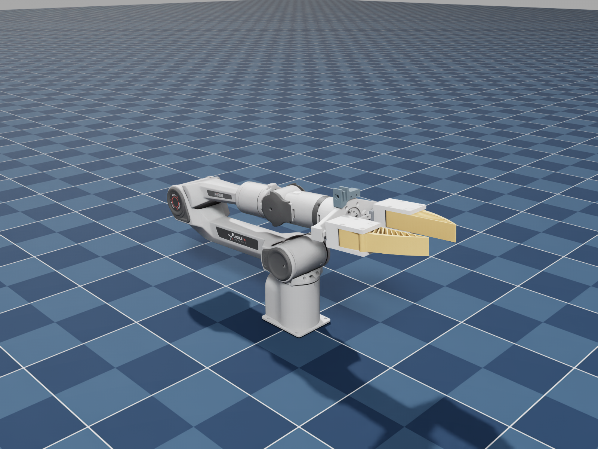
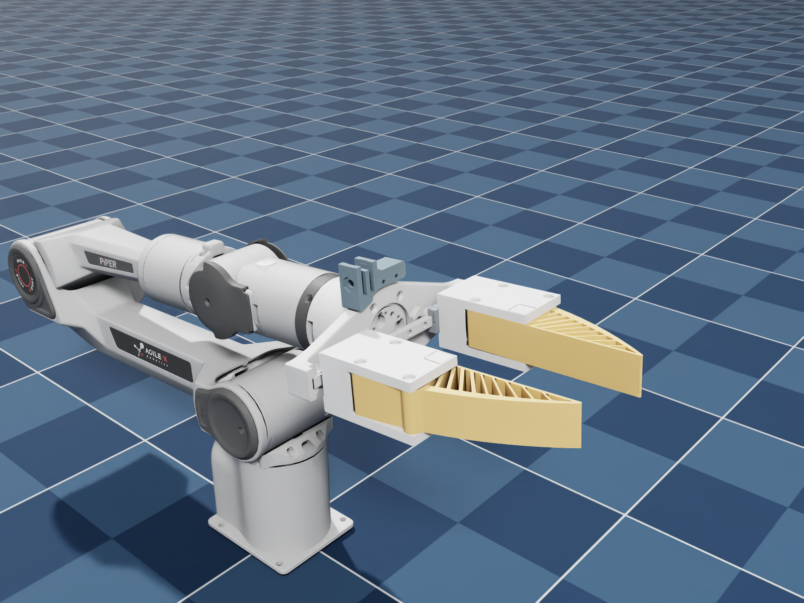

<div align="center">

# Piper × UMI Assets

**Piper 六轴机械臂 · UMI 平行夹爪 · 三种独立模型格式**

`URDF` · `MuJoCo MJCF` · `USD / Isaac Sim`

[模型入口](#模型入口) · [快速使用](#快速使用) · [夹爪控制](#夹爪控制) · [相机支架对齐与误差](#相机支架对齐与误差)



</div>

## 安装结论

已完成 CAD 装配及仿真验证，可进入实物安装验证阶段。原设计相机安装基准偏差约 **0.28 mm**，同开度、根部平均基准复核约 **0.39 mm**；实物配合与相机外参待装机确认。

[查看安装结论报告（HTML）](usd/installation_conclusion.html) · 下载后用浏览器打开，可离线阅读。

## 模型入口

| 格式 | 机器人模型 | 带地板的预览场景 | 使用说明 |
| :-- | :-- | :-- | :-- |
| URDF | [piper_umi.urdf](urdf/piper_umi.urdf) | ROS 2 / RViz 入口随包提供 | [URDF README](urdf/README.md) |
| MuJoCo XML | [piper_umi.xml](xml/piper_umi.xml) | [scene.xml](xml/scene.xml) | [MJCF README](xml/README.md) |
| USD / Isaac Sim | [piper_umi.usd](usd/piper_umi.usd) | [scene.usda](usd/scene.usda) | [USD README](usd/README.md) |

每个格式目录均包含完整依赖，可独立复制使用。机械臂采用修正后的外观网格，link6 与安装法兰使用原生件；两侧支座为白色，软指为浅桔黄色。



## 快速使用

### MuJoCo

在仓库根目录运行：

```bash
python -m pip install 'mujoco>=3.3.5,<4'
python xml/demo.py --animate
```

也可以直接加载：

```python
from pathlib import Path
import mujoco

scene = Path("xml/scene.xml").resolve()
model = mujoco.MjModel.from_xml_path(str(scene))
data = mujoco.MjData(model)
mujoco.mj_resetDataKeyframe(model, data, 0)  # 截图对应的装配关节姿态

data.ctrl[6] = 0.025  # 单指向外移动 25 mm；右指由等式约束跟随
mujoco.mj_step(model, data)
```

### Isaac Sim

1. 打开 `usd/scene.usda`，预览场景已含地板、灯光和机器人。
2. 或将 `usd/piper_umi.usd` 引用到自己的场景；默认 prim 为 `/PiperUMI`，关节系统根为其 `base_link`。
3. 控制 `joint1`–`joint6` 和 `gripper_left_joint`；右指使用 PhysX mimic，避免再给右指添加独立驱动。

装配姿态见各目录 `model_info.json` 中的 `cad_qpos`。

### URDF / ROS 2

通用导入器直接加载 `urdf/piper_umi.urdf`，保持相邻 `meshes/` 目录完整。ROS 2 中将 `urdf/` 作为包 `piper_umi_description` 放入工作区 `src/`，编译后运行：

```bash
ros2 launch piper_umi_description display.launch.py
```

URDF 包含右指 `<mimic>`；导入器需支持这一语义。MuJoCo 直接导入 URDF 不会自动建立物理联动约束，MuJoCo 仿真应使用本仓库的 XML。

## 夹爪控制

- 六个旋转关节：`joint1`–`joint6`。
- 两个平移关节：`gripper_left_joint`、`gripper_right_joint`。
- **8 个物理关节坐标，7 路独立控制。** 两侧空间轴相反，标量关节值相同；URDF mimic 倍率为 `+1`。

| 参数 | 数值 / 含义 |
| :-- | :-- |
| 单指移动量 `q` | `0 ≤ q ≤ 0.05 m`，向外张开为正 |
| 两指总行程 | 标称 100 mm |
| 投影内侧间距 `g` | 约 `g = 2.882 + 2 × q_mm` mm |
| 投影间距范围 | 约 2.882–102.882 mm |
| 截图装配姿态 | 每侧约 29.9688 mm，投影开口约 62.820 mm |
| 单位 | m、kg、rad；USD 原生角度限位属性使用度 |

`q=0` 是本模型的保守闭合端，不代表软指表面完全贴合。最小滑块间隙为 0.2 mm。以上开度来自 CAD 几何与标称行程，不代替实物限位标定。

## 相机支架对齐与误差

以相机安装孔轴线与中间耳片中面的交点为基准，复核结果如下：

| 对比方式 | 位置偏差 | 孔轴线夹角 |
| :-- | --: | --: |
| 原 SW 总装中 Piper 与隐藏 UMI 的设计叠放位置 | **0.284 mm** | 约 **0°** |
| 中线对齐、同开度，以软指根部平均位置为基准 | **0.386 mm** | **0°** |

第二项三轴差值为 **(+0.002, −0.341, +0.180) mm**，依次为开合、指尖、高度方向。Piper 两侧根部仍有 0.420 mm 高度差，因此采用平均根部基准，不额外倾转机构。两支架另有一处耳片间隙相差 2 mm。

以上为 CAD 机械基准偏差，非相机光心外参。详细数值见 [camera_alignment.json](usd/camera_alignment.json)。

## 验证

三种格式均已独立加载；已在 MuJoCo 3.3.5 和 Isaac Sim 5.1.0 验证六轴运动与夹爪联动。软指按刚体处理，末端惯量为估算值，碰撞几何使用凸包近似。

## 来源与许可

官方运动学、原生输出盘及法兰来自 [AgileX agx_arm_urdf](https://github.com/agilexrobotics/agx_arm_urdf/tree/f6642ce0d7872c686f29c99e9e10cd23d1d49313)，固定版本 `f6642ce0`；部分外观颜色恢复自 [Piper 官方 DAE](https://github.com/agilexrobotics/piper_ros/tree/noetic/src/piper_description/meshes/dae)。用户提供的 Piper 外观与 UMI CAD 用于相应派生网格。

各格式目录附来源记录与上游许可；用户提供的 CAD / 网格未统一重新授权。
