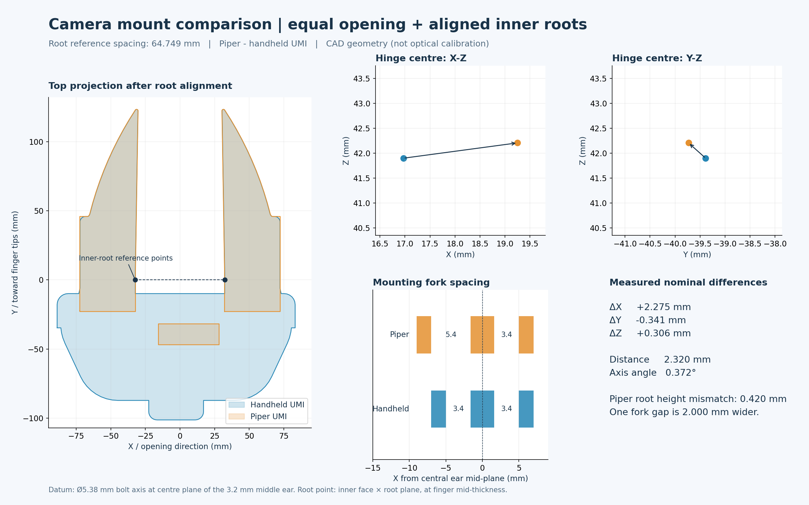

<div align="center">

# Piper × UMI Assets

**Piper 六轴机械臂 · UMI 平行夹爪 · 三种独立模型格式**

`URDF` · `MuJoCo MJCF` · `USD / Isaac Sim`

[模型入口](#模型入口) · [快速使用](#快速使用) · [夹爪控制](#夹爪控制) · [相机支架对齐与误差](#相机支架对齐与误差)


*Isaac Sim 5.1.0 实际渲染：白色支座、浅桔黄色软指、蓝色格子地板。*

</div>

## 模型入口

| 格式 | 机器人模型 | 带地板的预览场景 | 使用说明 |
| :-- | :-- | :-- | :-- |
| URDF | [piper_umi.urdf](urdf/piper_umi.urdf) | ROS 2 / RViz 入口随包提供 | [URDF README](urdf/README.md) |
| MuJoCo XML | [piper_umi.xml](xml/piper_umi.xml) | [scene.xml](xml/scene.xml) | [MJCF README](xml/README.md) |
| USD / Isaac Sim | [piper_umi.usd](usd/piper_umi.usd) | [scene.usda](usd/scene.usda) | [USD README](usd/README.md) |

**每个格式目录可独立复制和使用。** 网格、材质与场景贴图均使用包内依赖；不需要原始 STEP / SolidWorks 文件，也不需要另外两种格式的文件夹。软件运行时需自行安装。

```text
piper-umi-asset/
├── README.md
├── urdf/    # 机器人、网格、关节定义和 ROS 2 可视化配置
├── xml/     # MuJoCo 模型、网格、蓝色格子场景与演示入口
└── usd/     # USD 模型、场景、地板贴图与 README 装配截图
```

### 装配细节


| 部件 | 当前资产 |
| :-- | :-- |
| 机械臂外观 | 用户提供的 Piper 外观网格，保留盖板和铭牌几何；缺失材质颜色按官方对应 DAE 补齐 |
| link6 输出盘 / 安装法兰 | AgileX 原生件；原自改的 UMI-PIPER-CAMERA-MOUNT 不在当前资产中 |
| UMI 手指支座 | 白色，两侧随滑块运动 |
| 软指外观 | 浅桔黄色；仿真中按刚体处理 |
| 导轨 / 夹爪主体 | 保留当前装配的 155 mm 导轨与 UMI 机构，标称总行程 100 mm |
| 相机支架 | 保留 Piper 装配中的相机底座，固定于夹爪主体；不随单侧手指开合 |

## 快速使用

### MuJoCo

在仓库根目录运行：

```bash
python -m pip install 'mujoco>=3.3.5,<4'
python xml/demo.py --animate
```

也可以直接加载：

```python
from pathlib import Path
import mujoco

scene = Path("xml/scene.xml").resolve()
model = mujoco.MjModel.from_xml_path(str(scene))
data = mujoco.MjData(model)
mujoco.mj_resetDataKeyframe(model, data, 0)  # 截图对应的装配关节姿态

data.ctrl[6] = 0.025  # 单指向外移动 25 mm；右指由等式约束跟随
mujoco.mj_step(model, data)
```

### Isaac Sim

1. 打开 `usd/scene.usda`，预览场景已含地板、灯光和机器人。
2. 或将 `usd/piper_umi.usd` 引用到自己的场景；默认 prim 为 `/PiperUMI`，关节系统根为其 `base_link`。
3. 控制 `joint1`–`joint6` 和 `gripper_left_joint`；右指使用 PhysX mimic，避免再给右指添加独立驱动。

机器人默认关节状态为零位、夹爪闭合；截图中的装配姿态记录在每个目录的 `model_info.json` 的 `cad_qpos`。相机与场景光照会影响屏幕上的颜色观感。

### URDF / ROS 2

通用导入器直接加载 `urdf/piper_umi.urdf`，保持相邻 `meshes/` 目录完整。ROS 2 中将 `urdf/` 作为包 `piper_umi_description` 放入工作区 `src/`，编译后运行：

```bash
ros2 launch piper_umi_description display.launch.py
```

URDF 包含右指 `<mimic>`；导入器需支持这一语义。MuJoCo 直接导入 URDF 不会自动建立物理联动约束，MuJoCo 仿真应使用本仓库的 XML。

## 夹爪控制

- 六个旋转关节：`joint1`–`joint6`。
- 两个平移关节：`gripper_left_joint`、`gripper_right_joint`。
- **8 个物理关节坐标，7 路独立控制。** 两侧空间轴相反，标量关节值相同；URDF mimic 倍率为 `+1`。

| 参数 | 数值 / 含义 |
| :-- | :-- |
| 单指移动量 `q` | `0 ≤ q ≤ 0.05 m`，向外张开为正 |
| 两指总行程 | 标称 100 mm |
| 投影内侧间距 `g` | 约 `g = 2.882 + 2 × q_mm` mm |
| 投影间距范围 | 约 2.882–102.882 mm |
| 截图装配姿态 | 每侧约 29.9688 mm，投影开口约 62.820 mm |
| 单位 | m、kg、rad；USD 原生角度限位属性使用度 |

`q=0` 是本模型的保守闭合端，不代表软指表面完全贴合。最小滑块间隙为 0.2 mm。以上开度来自 CAD 几何与标称行程，不代替实物限位标定。

## 相机支架对齐与误差

相机支架按以下条件比较：**软爪根部内侧对齐，夹爪中心线和指向对齐，开口采用手持 UMI 当前保存的根部内开口约 64.75 mm**。

参考手持 UMI 已由 `handle-umi-assemble.SLDASM` 直接转换，使用 Isaac Sim 自带 HOOPS CAD 转换器，保留 31 个网格及装配位姿。原始 SW 文件和分析临时文件不包含在这个模型资产仓库中。

### 对齐后的结果

**相机支架机械基准相差约 2.32 mm，螺栓孔轴线夹角约 0.372°。** 这里比较的是相机支架的安装接口，不是相机光心。

公共坐标系：`+X` 从左侧根部指向右侧根部，`+Y` 指向指尖，`+Z = X × Y` 指向相机一侧。下表符号均为 **Piper − 手持 UMI**。

| 比较项 | CAD 名义偏差 | 含义 |
| :-- | --: | :-- |
| 横向 `ΔX` | **+2.275 mm** | Piper 基准偏向 `+X` |
| 前后 `ΔY` | **-0.341 mm** | Piper 基准更靠近手柄一侧 |
| 高度 `ΔZ` | **+0.306 mm** | Piper 基准更靠近相机一侧 |
| 合成位置距离 | **2.320 mm** | 上述三轴差值的欧氏距离 |
| 安装孔轴线夹角 | **0.372°** | 对齐根部后的孔轴线差异 |



### 两个不能忽略的装配差异

1. **Piper 左右软指根部不等高，差约 0.420 mm。** 对齐两侧根部参考点时，需要整体倾转 Piper 末端约 0.372°。因此，上面的孔轴线夹角包含根部对齐所引入的旋转，不能简单解释成相机支架自身加工歪了 0.372°。
2. **Piper 相机安装耳片的一处间隙比手持 UMI 宽 2.000 mm。** 两者耳片厚度都是 `2 / 3.2 / 2 mm`；手持 UMI 两个间隙为 `3.4 / 3.4 mm`，Piper 为 `5.4 / 3.4 mm`，整体耳片跨度分别为 `14 / 16 mm`。相机适配件的夹紧配合应单独检查，这个尺寸差不会因根部对齐而消失。

<details>
<summary><strong>测量基准、精确开度与复核方法</strong></summary>

- **软指根部参考点**：根部端面与内侧夹持面的交线，在 25.8 mm 指厚方向取中点；原软指零件坐标为 `(0, -12.9, 0) mm`。对齐左右两点、其中点及两指平均指向。
- **相机支架参考点**：直径 `5.38 mm` 螺栓孔的轴线，与中间 `3.2 mm` 耳片中面的交点。由于两套支架整体耳片宽度不同，不使用外包围盒中心或圆柱任意参数原点作基准。
- **相同根部内开口**：两侧根部参考点间距均为 `64.749142 mm`。Piper 存在 0.420 mm 根部高度差，对应沿导轨的投影间距为 `64.747780 mm`；约 0.00136 mm 的差别来自斜边与投影的定义，不是额外开度误差。
- **Piper 关节设置**：两侧平移关节各为 `0.028941877 m`。模型默认装配姿态的每侧 `29.9688 mm` 是另一开度，不能直接拿默认截图来测这组误差。
- 开度归一化采用两侧刚性、等量反向移动，并保留各源装配根部中点。没有模拟软指压缩或重解手持 UMI 的内部连杆。
- 已用实际导出模型的关节变换独立复核：根部参考点重合及相机基准位置与上述 CAD 分析一致。这个复核是数值一致性检查，不是制造精度证明。
- 本次仅比较相同开度下的装配偏差，不把 SW 保存姿态解释为机构最大开度，也不据此给出实物最大行程。

完整数值、源文件哈希及条件见 [camera_alignment.json](usd/camera_alignment.json)。三种格式目录各附一份同样的记录。

</details>


**支架位置偏差不等于相机光心外参误差。** 支架 CAD 不能单独确定镜头光心、光轴和可调夹持角度；相机装配公差、打印误差、软指形变也需要实物标定。当前资产的 `tool0` 是指尖附近的名义参考点，并非已标定相机坐标系。

本资产恢复原生法兰时，末端相对 link6 沿 Z 方向调整约 **+3.013 mm**，并做微小 XY 对中修正。该数值描述的是原生法兰与原自改装配的差别；根部对齐会消除整套末端的共同刚体位移，因此不能把它直接当作 Piper 与手持 UMI 的相机支架误差。

## 验证与使用边界

| 检查 | 已验证结果 |
| :-- | :-- |
| 三种格式独立复制 / 加载 | 均通过；USD 机器人资产无需外部网格，场景地板贴图随 USD 目录提供 |
| 视觉颜色 | 86 个视觉部件在三种格式中保持相同颜色定义 |
| URDF / MuJoCo 正运动学 | 32 个姿态，最大位置数值差约 `5.30e-11 m` |
| MuJoCo 3.3.5 | 5500 步，启用重力与碰撞；全行程夹爪及六轴运动通过，数值警告为 0 |
| Isaac Sim 5.1.0 | 8 个关节识别正常，实际 FK、全行程联动与 RTX 渲染均已运行 |
| ROS 2 / RViz | 提供可视化入口；本机未执行 ROS 2 可视化 |

这些检查验证的是导出一致性与仿真运行，不代表实物精度。软指不模拟硅胶形变；夹爪采用理想平行联动；自制末端惯量为估算。碰撞体采用 49 个凸包，孔洞和凹槽被简化，不能用于精细接触或打印件强度验证。

## 来源与许可

官方运动学、原生输出盘及法兰来自 [AgileX agx_arm_urdf](https://github.com/agilexrobotics/agx_arm_urdf/tree/f6642ce0d7872c686f29c99e9e10cd23d1d49313)，固定版本 `f6642ce0`；部分外观颜色恢复自 [Piper 官方 DAE](https://github.com/agilexrobotics/piper_ros/tree/noetic/src/piper_description/meshes/dae)。用户提供的 Piper 外观与 UMI CAD 用于相应派生网格。

每个格式目录保留上游许可文本及 `THIRD_PARTY_NOTICES.md`，`source_manifest.json` 记录来源与哈希。**上游 MIT 许可不自动覆盖所有用户提供的 CAD / 网格；本仓库没有将这些资产统一重新授权。**
